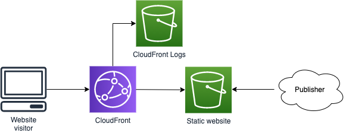
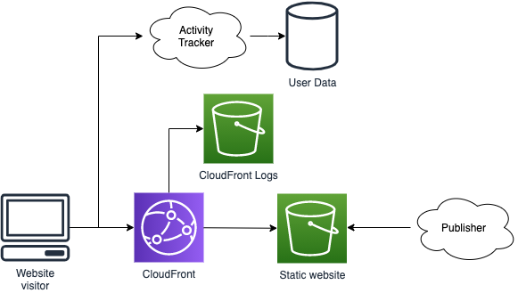
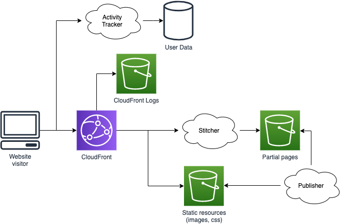
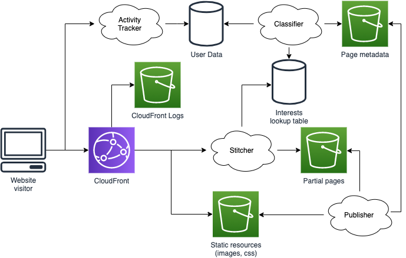

# Personalised website 1: Overview

This is the first of a three-part series talking about how a hypothetical media website might approach personalisation. Over the past couple of years I've spent periods lurking in subreddits like [/r/AskProgramming/](https://www.reddit.com/r/AskProgramming/) and [/r/learnprogramming/](https://www.reddit.com/r/learnprogramming/) where there are often questions about how to start projects - and examples of new developers trying to jump from am empty editor to a fully fledged product with no steps in between. Giving an example of how a system might start small and evolve over time feels like it might be helpful.

This series focuses on the evolution of the overall picture of an example system, the interaction of components and how those relate to a business context, rather than on code-level examples. We'll see how knowing the context of the system can drive many of the lower level decisions, and how development of one subsystem can impact on the others.

This part talks about the general structure of the system and its main components. In [part 2](./part2-stitcher.md) and [part 3](./part3-classifier.md) we'll look into a couple of these in more detail.

## Our scenario

Our hypothetical media website could be a video streaming service, or the website for a newspaper or magazine. Through personalisation we want to provide the user with content they're interested in. This is because the more videos they watch, or articles they read, the more likely they are to keep using our service, which drives revenue. This is a similar problem to personalising which adverts are displayed on websites, or suggesting products to add to a shopping cart.

We want a cheap solution that will scale up to large numbers of users as our website grows in size and popularity. If we're honest we also don't know much about our users use our service. We have an idea of the audience we're targeting, and what we can offer them - and we know how we want them to do things, but that's it. We're not sure which links people are going to be using between our content, or how much they're consuming. We're not sure if they'll all access the same content, or how much they're going to access, or how often.

## Our first website

To start off with we're going to ignore personalisation - its our end goal, but we can't personalise a website until we have one. People aren't coming for the customisation, they're coming for the content - that's the first thing we need to deliver.

We're going to base our website around a static publishing approach. With computation costs being more significant than storage costs, costs are kept down by pre-calculating the webpages once and serving them many time. Using AWS technologies that might give us an architecture something like this:

Here we have some sort of loosely defined publishing process that calculates our website and publishes it into an S3 bucket. That bucket is used as the origin for a CloudFront distribution, which is used to serve the content. We save the access logs CloudFront provides to analyse later.

The log analysis supports our first efforts to understand our audience. We can see which pieces of content are most popular, and which least. We can see if those vary over time. We can use this information to generate things like a top ten list of content, feed it into the people deciding what's on our splash pages, and provide it as feedback to the people creating the content. We can put up pieces of content in different styles, or on different subjects, and see which our users access most. We can maybe start to identify trends around if some pieces of content should be promoted in the morning and others in the evening.

The publisher could be configured to overwrite the entire site as updates to content arrive, or to only add, update and delete content as it changes. If we only have a small set of content available then overwriting the entire site may be feasible, but as our site develops that processing will gradually become more and more expensive. On the other hand the processing logic for creating a complete replacement site is simpler. We'd probably want to start with the simple option and switch over later, particularly since we can expect to update our publisher in later steps.

## Learning more

Access logs only tell us part of the story, when the page is fetched by the browser. That might start to give us enough information to perform some customisation, but what about when someone opens content in a new tab, but never gets round to viewing it? What about when someone opens the page for a couple of seconds, glances at it and then closes it without reading? How far down the page have people scrolled? We could maybe detect some of these things using [browser events](https://developer.mozilla.org/en-US/docs/Web/Events), but we'll need somewhere to send that information. We evolve our architecture by adding in a new "tracker" service:

This tracker service gives us more information about how people are using our site, which we add into our feedback loop. We're still not at a personalised service, but we're learning more about our audience. We'll want to come back to this service as we introduce sign-in, so we can learn more about individual behaviours rather than full audience behaviours, but in the meantime we can probably get some return on investment by learning more about our audience in general.

## Sign-in

To personalise a website to an individual we have to know who they are. We'll therefore want to put sign in and log out links on the page, and add a sign-in flow. This means we have to move away from pre-publishing the page in its entirety - but doesn't mean we can't do so at all. Our content is largely unchanged for each user at this point, so we can pre-calculate partial pages, and use a "stitcher" service to join a changing login/logout banner together with the rest of the page: 

Immediately after doing this we update the tracker service to record the user's login ID alongside their activity. This data will be the basis for our personalised recommendations.

## Our first personalisation

Our next step is to figure out how we're providing personalisation. To start off with we probably don't know that much about our user - we've only just started tracking details about them as an individual. We might start by trying to classify them; for example when they look at our music pages which genre do they look at most? We might have a list of five or six genres we cover - classical, dance, rock, and so on. Using a classifier we record this against their user IDs in a quick look-up table of some description. To do this we need to know about the genre of the pages people are looking at, so we'll update the publisher to record that page metadata.

At the same time we have our content curators create a different set of follow-on links for each genre. We update our publisher to publish them alongside pre-generated versions of the music pages that omit the links block. The stitcher has its capabilities expanded so that for music pages it accesses the look-up table and find which genre the user prefers, and to stitch the links for that genre into the page.

We're now providing a degree of personalisation for our users, even though we're treating them as a member of a group with a given interest, rather than as a completely unique individual. That's fine - people aren't always totally unique; consider how many people would say they're a fan of a given TV show, but other than that might have completely different interests. If we give all of those people with that shared interest the same links based on that shared interest, there's a good chance a large number of them will click on them - or not - in the same way. As we classify the user into more groups we will be able to refine this to more accurately target their interests.

As we've put this in place we've continued to minimise the amount of processing we're doing, minimising the resources (and so cost) to serve each page.  Our architecture now looks like this:

Through the tracker we continue to record information about user behaviour. Using a classifier we put it into context through metadata provided by the publisher, allowing our system to classify user activity and derive conclusions about their interests. We can choose whether to run the classifier periodically or have it update in real time as new tracker information becomes available. It's unlikely that user interests will change particularly quickly once we have their preferences established, so we'd probably process tracker updates in periodic batches to minimise processing overheads.

## And beyond

This doesn't put our website in a final "finished" state - in truth we'll never be finished. As our volume of user activity data and volume of content increases we'll be able to expand our personalisation beyond music links, and explore other personalisation approaches. We'll be able to start explore automatic curation of follow-on links, so we don't need an army of curators as our content range expands. We'll be able to look at doing A/B testing for different page layouts. We'll be able to do extension after extension after extension. As the system grows sometimes we'll need to rewrite or replace sections. Maybe our development team will grow and we'll be able to do some of these things in parallel. But we'll continue to work incrementally.

In the other two entries in this series we'll dive more deeply into some of the things we'll want to consider when [developing the stitcher](./part2-stitcher.md) and some thoughts about [classifying user interests](./part3-classifier.md).