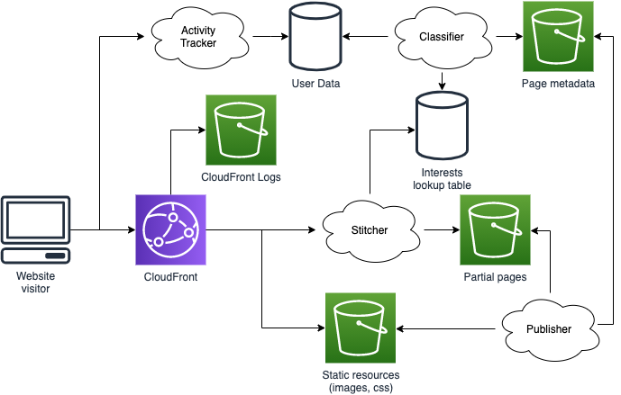

# Personalised website 2: Stitcher considerations

In [part 1](./part1-overview.md) we talked about a way of building a basic structure for a personalised website. In the architecture diagram we ended up with there were a few systems we represented as vague fluffy clouds without much in the way of details. These were the publisher, the stitcher, the activity tracker, and the classifier:

These systems were left largely undefined because they may vary a great deal based on the needs of the website, but let's take a closer look.

To quickly recap, we're after a cheap solution that will scale well. That's led us to decide to try and perform as much processing as possible once, and to serve that processed content many times, because CPU time is currently generally more expensive than storage.

This has led us towards static publishing of assets (like images and CSS), website pages, and partial website pages that we stitch together to provide personalisation. A lot of this rests on the understanding that the majority of content of our pages doesn't change; whether it's headers, footers, or just the main text, images, and video, there's a lot that's common between users and doesn't need to be re-calculated for personalisation.

As our website started to evolve we also recognised that everyone is not completely unique. We decided to classify people around how much they look at content based on things like different genres of music, and to serve a different set of follow-on links on content pages based on that classification. Eventually, through classifying enough behaviour for a user in different interest areas (e.g. music, sport, etc.), we'd have a fairly good idea of what content we have available that they're likely to be interested in across our site. Our stitcher can then use that information to inject the correct set of follow-on links.

## Is this a good personalisation strategy?

This approach should lead to a strong feeling of personalisation in our users. By having *N* interests (e.g. music, sport) each with *Y* distinct sub-areas (e.g. football, golf), we have *Y to the power of N* combinations of sub-areas, which becomes fairly unique fairly quickly. As an evolution of this we don't need to restrict people to being interested in just one sub-area; as we gain enough data we could allow each user's interest to have ten "slots" for sub-areas of interest and fill them proportionally. We might find we have some users that use these slots up as 10 football and 0 golf, and others that are 3 football and 7 golf, or 1 football, 1 golf and 8 motorsport. 

Eventually we might experiment with moving away from this strategy. As we gain enough data about user activity we may be able to explore other personalisation approaches, such as creating a Machine Learning (ML) model to provide personalised follow-on links for us based on a more detailed list of content we've viewed. While ML is currently quite a popular set of technology it does have its limitations; as the range of possible inputs and outputs increases so does the amount of data needed to train and evaluate a reliable ML model.

We're trying to recongnise and respond to something as varied as human interests, to suggest content across our entire range - and as a media website we'll have a lot of different content. Pleasing everyone perfectly all of the time will be impossible, so consider the business metrics that you're trying to meet and how you can measure them. Is the amount of content consumed the important thing? The breadth of topics covered in the consumed content? The regularity with which the service is used? What are acceptable and unacceptable numbers for your metrics? We also need to remember that individual and overall audience preferences change over time; we will need to continually monitor and evaluate our performance, or we will fall away from our targets as that happens.

## Stitcher trade-offs

The stitcher first comes into being in the third stage of our architecture's evolution, at the point where we have a log-in flow for the users and need to start switching between sign-in and sign-out links. 

It's usual to let people know which account they're signed in as by displaying a username as part of sign out links. This means we'll need to have an aspect of templating involved, but to minimise processing (and so cost) we'll want to keep that template processing as light as possible. This could mean minimising the size of the template we're processing. Rather than having our publisher output just the changing pieces of content for us to  plug into full-page templates, we might approach this using one small template for the area that changes, with two larger static blocks - the page up to our templated block, and the page after it. This decision significantly impact our stitcher input (our publisher output).

At this point we'll want to consider our trade-offs. We might start by asking how much of our pages actually change for each different user and piece of content? At this stage we're not making many changes for the user. Sign-in and sign-out buttons are often part of the header banners and navigation links that are common to all pages, and sometimes part of the common footers too. More parts are changing on a page-by-page basis because of the content; not just the content area of the page, but also things like the HTML `<title>` tag, or the [Open Graph](https://ogp.me/) tags that are used for social media link previews.
 
We have to process these cross-user changes as part of some sort of page template at either publish time or at request time. It's tempting to do this at request time; since we're doing templating for the user-related changes we could easily make it all part of the same template processed at that point. However if the same article is requested many times we're going to be doing the same processing many times. That means repeated CPU cost. In contrast doing this at publish time means we're doing a lot of work then, which might be wasted if the page isn't visited.

Network latency might be a consideration. Either way the stitcher will need to fetch the page content from our partial pages, and our users will want a fast, responsive experience. If our approach changes the number of calls we make to fetch pieces of content, will that be a factor? Could we make those calls in parallel? What does all this fetching mean in terms of network data transfer costs? Or in terms of the number of network sockets each incoming request will consume? Do the technologies we want to use have hard limits in these areas?

There's also where the stitcher is going in the future to consider. In our next stage we're going to be switching in and out different sets of links based on user interests, and if we end up taking the "slot" based approach we might even be mixing and matching them. That's going to involve lookup overhead to find classifier results, and the fetching of different follow-on link sets to process into the page. However we progress we can reasonably assume we will be fetching more content and user data, and doing more template processing, as our level of personalisation increases across the site.

If we have the time and resources for the work we could implement all possible approaches, benchmarking performance and comparing results against each other to help us decide. In most circumstances we won't have that luxury, and we need to use logic, experience, and educated guesswork to help us make a decision.

We might argue that template processing is likely to be more CPU-intensive than in-parallel fetching of additional content, where we might be waiting on networking calls, so in the absence of other considerations we will decide to minimise as much repeated template processing as possible - even if that means doing consuming more storage for pre-processed page fragments and doing more work in the publisher. This might have knock-one effects, such as performing more parallel network fetches, which could impact on decisions like the amount of emphasis placed on monitoring the availability of threads and network sockets.

## Problems with advanced personalisation logic

At first the stitcher will only need fairly simple logic to stitch together a header, a sign-in/out button, and the rest of the article. As we move on to more involved personalisation we will need to build a more complex workflow. We might decide to take our visiting user's interests scores and run them through a [rule-based system](https://en.wikipedia.org/wiki/Rule-based_system) to make decisions about which links to include on a page, or provide them as input to a ML model to make that decision. How we want to do this in the stitcher will dictate the sort of output we need from our user data classification and processing systems.

Some problems with these decision making approaches might be around the system itself, such as the efficiency of the processing or how we handle new users that we don't have data on yet. We'll need to consider how the logic, rules, or ML model are going to be updated - people not only develop and change over time, but they are affected by everything from the time of day to the weather, to what events are happening in the world around them locally, nationally, and internationally.

There are a variety of less technical aspects to consider. A prominent example is the need to consider legal, industry, and company restrictions around the collection, retention, processing, and removal of user data. This could be particularly involved if you're providing services for users in other countries, or using cloud services that are hosted beyond your national borders.

From a business point of view we may need to be aware of things like the [echo chamber effect](https://en.wikipedia.org/wiki/Echo_chamber_(media)) for personalisation. If we base our recommendations on patterns of articles users have visited, what happens when we only provide links that match that pattern? We could end up with a feedback loop where the user is only given the option to follow interests we already think they have. That might give some short-term benefits, but does our long-term strategy mean we want users visiting a variety of content?

Some issues may even be ethical or societal concerns. If using ML we need to be aware of what biases we might introduce in our model. Some bias might be benign; if we have a training set of data where we have four articles on one interest for every one on another then we could find we've accidentally trained the model with a bias towards or against an interest. But if we include data about age, race, or gender (either of users or from within our content) we could introduce a discriminatory bias into our system. We are responsible for the ethics of how our systems behave.

## Next time

Here we've dived more deeply into considerations around the stitcher, which performs much of our content personalisation in our example architecture from [part 1](./part1-overview.md). In the final entry of this series examining this problem we'll be looking at [classifying user interests](./part3-classifier.md) in a little more depth.

